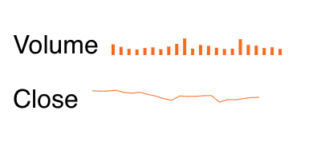

# Kendo UI Sparkline for Vue

##  Overview

A sparkline is a condensed version of a chart that shows a high-level overview of the data with minimal details. Its smaller size allows it to be embedded within text, spreadsheets, or other graphics. The Kendo UI sparkline component can be visualized as a line graph, bar chart, or pie chart. This demo uses data from a stock API to show historical volume and price information for Apple stock.

## Example



## Getting Started

See the following tutorial for instructions on basic usage:

[How to Use a Vue Sparkline UI Component in your Web App](https://www.telerik.com/blogs/how-to-use-a-vue-sparkline-ui-component-in-your-web-app)

## Build Setup

``` bash
# install dependencies
npm install

# serve with hot reload at localhost:8080
npm run dev

# build for production with minification
npm run build
```
## Related Links

- [Kendo UI Pie and Donut Chart for Vue](https://github.com/albertaw/kendoui-donutchart)
- [Kendo UI Scatter and Bubble Chart for Vue](https://github.com/albertaw/kendoui-bubblechart)
- [Kendo UI Bar Chart for Vue](https://github.com/albertaw/kendoui-barchart)
- [Kendo UI Line Chart for Vue](https://github.com/albertaw/kendoui-linechart)
- [Kendo UI StockChart for Vue](https://github.com/albertaw/kendoui-stockchart)

