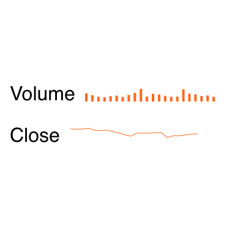

# Kendo UI Sparkline for Vue

##  Overview

A sparkline is a condensed version of a chart that shows a high-level overview of the data with minimal details. Its smaller size allows it to be embedded within text, spreadsheets, or other graphics. The Kendo UI sparkline component can be visualized as a line chart, bar chart, or pie chart.

Example:


See the following getting started tutorial to learn more:

[How to Use a Vue Sparkline UI Component in your Web App](https://www.telerik.com/blogs/how-to-use-a-vue-sparkline-ui-component-in-your-web-app)

## Build Setup

``` bash
# install dependencies
npm install

# serve with hot reload at localhost:8080
npm run dev

# build for production with minification
npm run build
```


